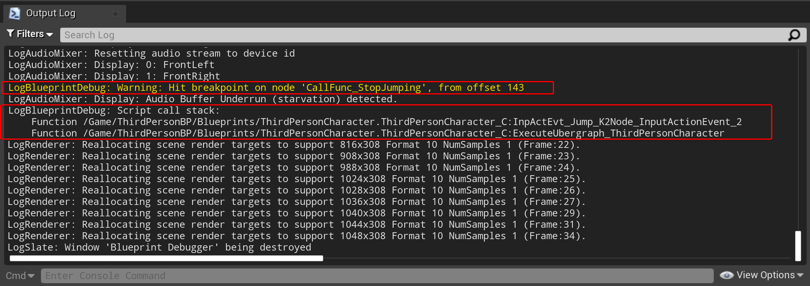

[TOC]

# 设计

## 需要打印的信息：

- 服务器or客户端or空(单机)
- 帧号
- 该条日志编号
- 时间戳
- 上下文Object的Name
- 调用堆栈
- 上一Frame的名称
- 当前断点函数节点名和索引(或偏移)
- 函数输入参数
- 函数输出参数

### 服务器or客户端or空(单机):

​	"PrintString()"函数或"UUEDebuggerBPLibrary::CustomPrintString()"自带该信息。

### 帧号: FrameCounter

### 该条日志编号: Index

### 时间戳: Timestamp

### 上下文Object的Name：ActiveObjectName

### 调用堆栈：StackTrace

### 上一Frame的名称：PreFrameName

### 当前断点函数节点名和索引(或偏移、或者UniqueID)：NodeName

### 函数输入参数：InputParameters

### 函数输出参数：OutputParameters

## 参考

### "BlueprintDebugger"工具

### "OutputLog"

"OutputLog"中有"LogBlueprintDebug"的相关信息：

# 实现

# 参考

## 相关代码

